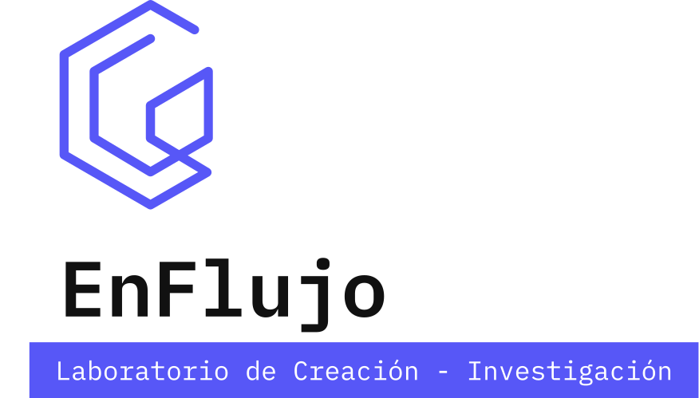
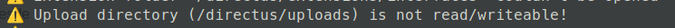
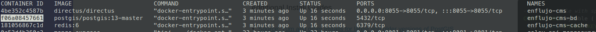

# EnFlujo CMS + API




El administrador de contenidos para los diferentes sitios web del laboratorio.

Es un _headless CMS_ en [Directus](https://directus.io/) independiente de las aplicaciones que construyen los sitios web. La idea es que el CMS sea un sitio único para administrar los contenidos, y que este exponga los datos por medio de un API. Usamos la nueva versión de Directus **>9** que esta hecha en NodeJS (antes era PHP).

:octocat: Este repositorio contiene la instancia de desarrollo del CMS pero cualquiera lo puede descargar, modificar y usarlo para otros proyectos.

:construction: Los desarrolladores de EnFlujo pueden hacer PR's para actualizar el CMS que usamos en producción. Las actualizaciones a este repositorio activan las acciones de despliegue en el servidor del laboratorio por medio de [Github Actions](https://docs.github.com/en/actions)

## Desarrollo

:heavy_exclamation_mark: Debe tener [Docker](https://docs.docker.com/get-docker/) instalado.

### Descargar repositorio

Debe descargar este repositorio en su computador. Desde el terminal, ir a la carpeta donde quiere descargar los archivos y desde allí clonar este repo:

```bash
git clone https://github.com/enflujo/enflujo-cms-api.git
```

Entrar a la carpeta que acaba de clonar:

```bash
cd enflujo-cms-api
```

### Variables ambiente `.env`

Crear un archivo que se llame `.env` y copiar en este el contenido del archivo `.env.ejemplo`. Aquí se ponen todas las claves e información privada. El archivo `.env` se omite en git (ver `.gitignore`).

### Iniciar contenedores Docker

Este es el comando que usamos cada vez que queremos iniciar la aplicación localmente:

```bash
# Si tiene problemas o quiere ver los "Logs" diretamente en el terminal,
# puede borrar -d del comando.
docker compose up -d
```

### Cambiar permiso de carpetas (Sólo en Linux)

Cambiar los permisos de las carpetas que se usan en volúmenes de docker. En Linux estas carpetas tienden a quedar bloqueadas para Directus entonces no podemos subir imágenes al CMS y en los `logs` de docker vemos este error:



Para solucionarlo, usar:

```bash
sudo chown -R 1000:1000 ./uploads
```

El CMS queda disponible en: http://localhost:8055/

Las credenciales del usuario predeterminado son:

email: **admin@admin.com**

clave: **admin**

Para apagar los contenedores:

```bash
docker compose down
```

La primera vez que iniciamos los contenedores se puede demorar mientras descarga las imágenes necesarias de Docker Hub. Luego de esa primera descarga, las imágenes quedan guardadas en su computador y el inicio es más rápido. _En este caso, imágenes se refiere a imágenes de Docker._

Las imágenes que usa esta aplicación son (ver la configuración y versiones en `docker-compose.yaml`):

- [Directus](https://hub.docker.com/r/directus/directus) para el CMS.
- [Postgres](https://hub.docker.com/_/postgres) para la base de datos.
- [Redis](https://hub.docker.com/_/redis) para el cache.

### Persistencia de datos y archivos

En Docker, cada vez que apagamos los contenedores se pierden los datos, pero para facilitar el desarrollo vamos a tener una estructura básica de inicio y algunos assets que construyen el administrador con esta configuración inicial.

En la primera iniciada de los contenedores se van a crear unas carpetas dentro de `/enflujo-cms-api` que estarán conectadas a los contenedores por medio de [Volumes](https://docs.docker.com/storage/volumes/). Que básicamente se encargan de crear un espejo entre los archivos dentro de los contenedores y unas carpetas locales. En el `docker-compose.yaml` esta conexión se ve así:

La lógica en Docker es primero la ruta local y luego la del contenedor

**local:contenedor**

```yaml
# Base de datos
# localmente en: ./datos
# en el contenedor: /var/lib/postgresql/data
bd:
  # ...
  volumes:
    - ./datos:/var/lib/postgresql/data

# CMS
directus:
  # ...
  volumes:
    - ./uploads:/directus/uploads
    - ./extensions:/directus/extensions
```

Cuando iniciamos por primera vez los contenedores, el proceso se encarga de crear las carpetas locales (si no existen) y se ve algo así:

```md
/enflujo-cms-api
/datos
/extensions
/uploads
```

Estas carpetas se pueden eliminar si se quiere crear una instancia de esta aplicación completamente desde cero.

## Desarrolladores de EnFlujo

La instancia básica que dejamos armada en este repositorio no va a reflejar exactamente la de producción, pero tiene algunos datos iniciales para trabajar sobre la misma base.

### Datos

La carpeta local `/datos` tiene la copia de los datos del contenedor `postgres`. Esta carpeta es ignorada en este repositorio ya que contiene demasiados archivos que son innecesarios. Cada uno puede tener su propia versión de `enflujo-cms-api/datos/` que va a contener cualquier cambio que hagan dentro del CMS. Pueden borrar `enflujo-cms-api/datos/` en cualquier momento para volver al estado inicial.

Al crear los contenedores desde cero con `docker-compose up` se van a copiar unos datos iniciales desde el archivo `dump/datos.sql`. Estos contienen:

- Los registros de la configuración general que se hace en "Settings->Project Setting" dentro de Directus.
- Registros del uso que le damos a las imágenes que tenemos en `/uploads`.
- Estructura de los datos: registros, entradas con información general, etc.

El archivo `dump/datos.sql` se debe crear de nuevo cuando cambiamos alguna imagen o se modifica la estructura de los datos. De esta manera los otros desarrolladores pueden reiniciar sus contenedores y tener la base con la nueva estructura.

Para crear un nuevo **dump**, ir en el terminal a esta carpeta y ejecutar el siguiente comando:

```bash
docker exec -t enflujo-cms-bd pg_dump -U enflujo --clean --column-inserts --if-exists --on-conflict-do-nothing > ./dump/datos.sql
```

### Extensiones

La carpeta local `/extensions` la usamos para modificar los usos predeterminados de Directus. Estos pueden ser al panel de administrador o al API (crear nuevos _endpoints_ o _hooks_, por ejemplo). Ver documentación de [extensiones en Directus](https://docs.directus.io/concepts/extensions/).

Los cambios en este directorio si se van a ver reflejados en producción. Para hacer cambios en las extensiones, crear un branch para cada implementación y crear PR cuando se quieran proponer a revisión.

### Ejecutar comandos directamente a base de datos (postgres)

A veces toca ir al contenedor a ejecutar comandos. Este es un ejemplo de como instalar las extensiones de postgis luego de tener la base de datos creada (los contenedores deben estar corriendo para que funcionen los siguientes pasos):

Buscar el `CONTAINER ID` del contenedor de la base de datos usando el siguiente comando que imprime la lista de contenedores que están corriendo:

```bash
docker ps
```

Se ve así:



Con el ID podemos entrar al contenedor:

```bash
docker exec -it f06a08457661 bash
```

Ya dentro del contenedor estamos en el shell bash donde podemos ejecutar comandos en el terminal que se ejecutan dentro del Linux del contenedor. En este tenemos instalado Postgres así que podemos usar comandos `psql`.

Con el siguiente comando nos conectamos con la base de datos, esto asume que el usuario es **enflujo** y el nombre de la base de datos es **bdenflujo**:

```bash
psql -h localhost -p 5432 -U enflujo -W -d bdenflujo
```

Conectados al postgres, podemos ejecutar comandos de SQL:

```bash
CREATE EXTENSION postgis;
```

```bash
CREATE EXTENSION postgis_topology;
```

```bash
CREATE EXTENSION fuzzystrmatch;
```

```bash
CREATE EXTENSION postgis_tiger_geocoder;
```

Estos comandos instalan Postgis y las extensiones básicas. Esto no es necesario pero sirve de ejemplo para entrar al contenedor y ejecutar cosas directamente en el ambiente de contenedor.
